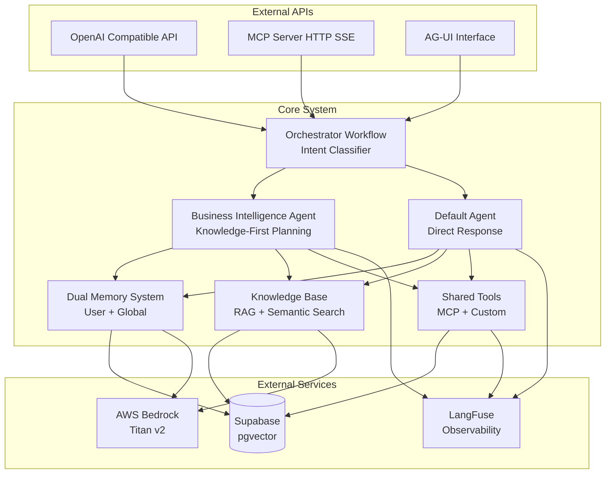

# Brius Business Intelligence System

A production-grade Mastra-based Business Intelligence agent system built with SpecKit and Claude Code, featuring intelligent orchestration, memory management, and comprehensive tool integration.

## 🚀 Project Overview

**Brius Business Intelligence** is an advanced AI-powered business intelligence system that acts as both an MCP (Model Context Protocol) client and server, providing OpenAI-compatible APIs for chat completions, models, and embeddings. The system implements intelligent orchestration with intent-based routing and integrates comprehensive observability via LangFuse.

### Key Features

- **🧠 Intelligent Agent Orchestration**: Intent-based routing between Business Intelligence and Default agents using multi-dimensional complexity scoring
- **💾 Dual Memory System**: User-scoped and global memory with semantic search using pgvector and AWS Bedrock Titan v2 embeddings
- **🔧 MCP Integration**: Acts as both MCP client (consuming external services) and MCP server (exposing agents/workflows)
- **🛠️ Comprehensive Tool Registry**: All tools from MCP servers, agents, knowledge base, and memory operations visible in Mastra playground
- **📊 OpenAI API Compatibility**: Full compatibility with OpenAI's REST APIs for seamless integration
- **📈 Business Intelligence Planning**: Knowledge-first planning workflows that prioritize knowledge base exploration
- **🔍 Advanced RAG Knowledge Base**: Document management with semantic search and hybrid search capabilities
- **📱 AG-UI Integration**: Interactive UI for agent conversations using Vercel AI SDK
- **🎯 Observability**: Comprehensive LangFuse integration with per-user tracking and performance metrics

## 🏗️ Built with SpecKit & Claude Code

This repository was architected and developed using **SpecKit** (Specify's feature specification framework) and **Claude Code** for implementation. The development process followed a structured approach:

### SpecKit Development Process

1. **Constitutional Foundation**: Established core principles in [`.specify/memory/constitution.md`](.specify/memory/constitution.md) including:
   - pgvector database architecture requirements
   - Mastra framework compliance
   - Comprehensive observability with LangFuse
   - MCP integration mandates
   - Feature-based clean architecture

2. **Feature Specification**: Created detailed specifications in [`specs/001-mastra-bi-system/spec.md`](specs/001-mastra-bi-system/spec.md) covering:
   - User scenarios and testing requirements
   - Functional and technical requirements
   - Success criteria and measurable outcomes
   - Edge cases and system behavior

3. **Implementation Planning**: Documented comprehensive architecture in [`docs/README.md`](docs/README.md) with:
   - High-level system architecture
   - Component specifications
   - Database schemas and migrations
   - API endpoints and data flows
   - Implementation timeline

4. **Claude Code Implementation**: Used Claude Code's capabilities to:
   - Generate TypeScript code following Mastra best practices
   - Implement agents, workflows, and tools
   - Set up MCP client/server architecture
   - Create comprehensive memory and knowledge systems

### SpecKit Templates Used

- **Constitution Template**: Defined non-negotiable architectural principles
- **Specification Template**: Detailed user scenarios and requirements
- **Planning Template**: Implementation roadmap and technical design
- **Tasks Template**: Granular development tasks and priorities

## 🛠️ Architecture

### Technology Stack

- **Framework**: [Mastra](https://mastra.ai) (TypeScript)
- **Runtime**: Node.js 20+
- **Database**: PostgreSQL 17 with pgvector extension
- **Embeddings**: AWS Bedrock Titan v2
- **Observability**: [LangFuse](https://langfuse.com)
- **Authentication**: Supabase JWT validation
- **Package Manager**: pnpm (required)

### System Components



## 🚦 Current Status

### ✅ Implemented Features

- [x] **Core Mastra Configuration**: Main system setup with agent and workflow registration
- [x] **Agent Architecture**: Business Intelligence and Default agents with shared tools
- [x] **Workflow System**: Intent classification and orchestration workflows
- [x] **MCP Server**: HTTP transport with comprehensive tool exposure
- [x] **Database Schema**: pgvector setup for memory and knowledge storage
- [x] **Memory System Foundation**: User and global memory operations structure
- [x] **Knowledge Base Framework**: Document processing and search capabilities
- [x] **Observability Integration**: LangFuse setup for comprehensive monitoring
- [x] **Authentication Middleware**: JWT validation and user context management
- [x] **API Endpoints**: OpenAI-compatible chat completions and models endpoints

### 🚧 In Progress

- [ ] **Complete Memory Implementation**: Full semantic search with Titan v2 embeddings
- [ ] **MCP Client Integration**: Dynamic loading from mcp.json configuration
- [ ] **Knowledge Base Processing**: Document upload and chunking strategies
- [ ] **Planning Workflow**: Knowledge-first execution for BI agent
- [ ] **Tool Registry**: Comprehensive playground with all tool sources
- [ ] **Advanced Routing**: Multi-dimensional complexity scoring implementation

### 📋 Planned Features

- [ ] **AG-UI Integration**: Interactive conversation interface
- [ ] **Advanced Analytics**: Query performance and usage metrics
- [ ] **Multi-tenant Support**: Organization-level data isolation
- [ ] **Plugin System**: Custom tool development framework
- [ ] **Real-time Collaboration**: Shared conversation contexts

## 🚀 Quick Start

### Prerequisites

- **Node.js**: >= 20.9.0
- **pnpm**: Latest version (required - do not use npm or yarn)
- **PostgreSQL**: 17+ with pgvector extension
- **AWS Account**: For Bedrock Titan v2 embeddings
- **Supabase Project**: For database and authentication

### 1. Environment Setup

```bash
# Clone the repository
git clone <repository-url>
cd brius-business-intelligence

# Install dependencies with pnpm
pnpm install

# Copy environment template
cp .env.example .env
```

### 2. Configure Environment Variables

Edit `.env` with your credentials:

```bash
# Supabase Configuration
NEXT_PUBLIC_SUPABASE_URL=https://your-project.supabase.co
NEXT_PUBLIC_SUPABASE_ANON_KEY=your-anon-key
SUPABASE_SERVICE_ROLE_KEY=your-service-role-key
SUPABASE_JWT_SECRET=your-jwt-secret

# AWS Bedrock Configuration
AWS_ACCESS_KEY_ID=your-access-key
AWS_SECRET_ACCESS_KEY=your-secret-key
AWS_REGION=us-east-1

# LangFuse Configuration
LANGFUSE_PUBLIC_KEY=your-public-key
LANGFUSE_SECRET_KEY=your-secret-key
LANGFUSE_BASE_URL=https://cloud.langfuse.com

# OpenAI Configuration (optional)
OPENAI_API_KEY=your-openai-key
```

### 3. Database Setup

Run the database migrations to set up the required tables:

```bash
# Apply migrations (requires Supabase CLI or direct SQL execution)
# See migrations/ directory for SQL files
```

### 4. Development

```bash
# Start development server
pnpm dev

# Start MCP server (separate terminal)
pnpm mcp:start:dev

# Run tests
pnpm test
```

### 5. Access Applications

- **Mastra Playground**: <http://localhost:4000>
- **MCP Server**: <http://localhost:3001>
- **Health Check**: <http://localhost:4000/health>

## 📖 Documentation

### Architecture Documentation

- **[System Architecture](docs/README.md)**: Comprehensive technical specification
- **[Agents & Workflows](docs/AGENTS_WORKFLOWS.md)**: Detailed agent and workflow documentation
- **[MCP Server Guide](docs/mcp-server.md)**: MCP server implementation details

### SpecKit Documentation

- **[Project Constitution](.specify/memory/constitution.md)**: Core architectural principles
- **[Feature Specification](specs/001-mastra-bi-system/spec.md)**: Complete feature requirements
- **[SpecKit Templates](.specify/templates/)**: Reusable development templates

### API Documentation

- **OpenAI Compatibility**: Full OpenAI v1 API compatibility
- **MCP Protocol**: HTTP Server-Sent Events transport
- **Knowledge Base**: Document upload and semantic search
- **Memory System**: User and global memory operations

## 🧪 Development Scripts

```bash
# Core Development
pnpm dev                    # Start Mastra development server
pnpm build                  # Build production bundle
pnpm start                  # Start production server
pnpm test                   # Run test suite

# MCP Server Operations
pnpm mcp:start             # Start MCP server (HTTP)
pnpm mcp:start:dev         # Start MCP server (development mode)
pnpm mcp:start:prod        # Start MCP server (production mode)
pnpm mcp:health            # Check MCP server health
pnpm mcp:stats             # Get MCP server statistics
pnpm mcp:info              # Get MCP server information
pnpm mcp:test              # Run MCP integration tests
```

## 🏗️ Project Structure

```text
brius-business-intelligence/
├── .specify/                    # SpecKit configuration and templates
│   ├── memory/constitution.md   # Core architectural principles
│   ├── templates/              # Development templates
│   └── scripts/                # Automation scripts
├── specs/                      # Feature specifications
│   └── 001-mastra-bi-system/   # Main system specification
├── docs/                       # Architecture documentation
│   ├── README.md               # Technical specification
│   ├── AGENTS_WORKFLOWS.md     # Agent/workflow docs
│   └── mcp-server.md           # MCP server guide
├── src/mastra/                 # Main application code
│   ├── index.ts                # Main Mastra configuration
│   ├── agents/                 # AI agents
│   ├── workflows/              # Multi-step workflows
│   ├── tools/                  # Shared tools
│   ├── mcp/                    # MCP client implementation
│   ├── mcp-server/             # MCP server implementation
│   ├── memory/                 # Memory system
│   ├── knowledge/              # Knowledge base
│   ├── auth/                   # Authentication
│   └── types/                  # Shared TypeScript types
├── migrations/                 # Database migrations
├── CLAUDE.md                   # Claude Code instructions
├── package.json                # Dependencies and scripts
└── README.md                   # This file
```

## 🎯 Key Design Principles

### 1. Feature-Based Clean Architecture

- Code organized by business features, not technical layers
- Self-contained components with clear interfaces
- Centralized type management in `src/mastra/types/`

### 2. Knowledge-First Planning

- Business Intelligence agent prioritizes knowledge base exploration
- Context-aware planning before execution
- Multi-step validation and error handling

### 3. Comprehensive Observability

- All interactions logged to LangFuse with user attribution
- Performance metrics and error tracking
- Tool execution monitoring and optimization

### 4. MCP-First Integration

- Seamless external system integration via MCP protocol
- Dynamic tool discovery and registration
- Namespace-based tool organization

### 5. Memory-Aware Responses

- User-scoped personal context and preferences
- Global organizational knowledge sharing
- Automatic memory injection into agent contexts

## 🔧 Configuration

### MCP Configuration (mcp.json)

```json
{
  "mcpServers": {
    "supabase": {
      "command": "npx",
      "args": ["-y", "@modelcontextprotocol/server-supabase"],
      "env": {
        "SUPABASE_URL": "${NEXT_PUBLIC_SUPABASE_URL}",
        "SUPABASE_ANON_KEY": "${NEXT_PUBLIC_SUPABASE_ANON_KEY}"
      }
    },
    "filesystem": {
      "command": "npx",
      "args": ["-y", "@modelcontextprotocol/server-filesystem", "/workspace"],
      "env": {}
    }
  }
}
```

### Mastra Configuration

The system is configured in [`src/mastra/index.ts`](src/mastra/index.ts) with:

- Agent registration (Business Intelligence, Default)
- Workflow registration (Orchestrator, Planning)
- Tool configuration and shared resources
- Memory and knowledge base integration
- Observability setup with LangFuse

## 🧪 Testing Strategy

### Unit Tests

- Component-level testing for all major modules
- Memory operations and embedding generation
- Workflow step validation and execution
- Tool integration and error handling

### Integration Tests

- MCP client-server communication
- Database operations and migrations
- API endpoint functionality
- Authentication and authorization flows

### End-to-End Tests

- Complete user conversation flows
- Multi-agent orchestration scenarios
- Knowledge base search and retrieval
- Memory system integration

## 🚀 Deployment

### Docker Support

```bash
# Build container
docker build -t brius-bi .

# Run with Docker Compose (includes PostgreSQL + LangFuse)
docker-compose up -d
```

### Production Considerations

- Use production-grade PostgreSQL with pgvector
- Configure proper SSL/TLS certificates
- Set up monitoring and alerting
- Implement backup strategies for vector data
- Use environment-specific configuration

## 🤝 Contributing

This project follows the SpecKit development methodology:

1. **Constitutional Compliance**: All changes must comply with architectural principles
2. **Specification-Driven**: New features require detailed specifications
3. **Documentation-First**: Update documentation before implementation
4. **Test Coverage**: Maintain >80% test coverage
5. **Code Quality**: Use pnpm, TypeScript strict mode, and ESLint

### Development Workflow

1. Review the [project constitution](.specify/memory/constitution.md)
2. Create feature specifications using SpecKit templates
3. Update architectural documentation
4. Implement with comprehensive testing
5. Validate against Mastra MCP servers
6. Submit PR with specification compliance verification

## 📄 License

This project is licensed under the ISC License - see the LICENSE file for details.

## 🆘 Support

- **Mastra Documentation**: <https://mastra.ai/docs>
- **SpecKit Framework**: <https://specify.dev>
- **Claude Code**: <https://claude.com/claude-code>
- **Project Issues**: Create issues in the repository for bugs and feature requests

## 📈 Performance Targets

- **Chat Completion**: < 500ms first token
- **Knowledge Search**: < 200ms response time
- **Memory Retrieval**: < 150ms for user context
- **Concurrent Users**: 100+ supported
- **Uptime**: 99.9% availability target

## 🔮 Future Roadmap

### Phase 2 Features

- Multi-tenant organization support
- Custom model fine-tuning capabilities
- Advanced analytics dashboard
- Real-time collaboration features
- Plugin system for custom tools
- GraphQL API endpoints

### Integration Expansions

- Additional MCP server connectors
- Webhook support for async operations
- Advanced visualization capabilities
- Mobile application support
- API marketplace integration

---

Built with ❤️ using SpecKit, Claude Code, and the Mastra framework